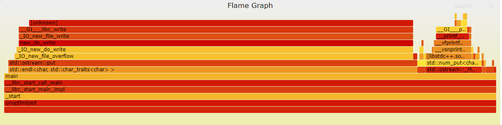
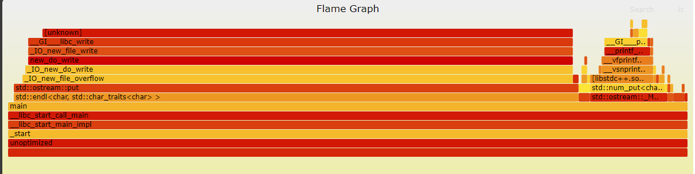
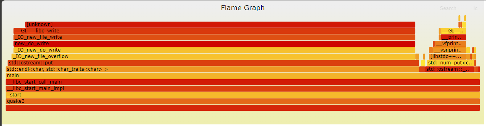

# Лабораторна 6 з системного програмування. Виконав студент групи ТК-31 Альгін Данило.  

## 1. Побудувати FlameGraph виконання:
### 1.1. Продемонструвати процес побудови  
Для побудови FlameGraph я використовував наступні команди:
```
sudo perf record -F 50 --call-graph dwarf ./unoptimized
sudo perf script | ../FlameGraph/FlameGraph/stackcollapse-perf.pl | ../FlameGraph/FlameGraph/stackcollapse-recursive.pl | ../FlameGraph/FlameGraph/flamegraph.pl > outUnoptimized.svg
```
<br>

### 1.2. Пояснити (інтерпретувати) отримані на графіку результати:
Я отримав наступний FlameGraph для програми unoptimized.cpp:
  
Глибина стеку не є занадто великою через нескладність структури викликів функцій у програмі.  
Основну частину часу виконання програми займають процеси, пов'язані з виводом у консоль.  
Обчислення заняли відносно невеликий час.  

<br>

## 2. Зібрати та пояснити статистику її виконання, зокрема:  
### 2.1. /usr/bin/time -- verbose \<\<prog\>\>:  
Команда:  
```
../../../../bin/time --verbose ./unoptimized
```

```
Command being timed: "./unoptimized"
 User time (seconds): 1.03
 System time (seconds): 3.86
 Percent of CPU this job got: 70%
 Elapsed (wall clock) time (h:mm:ss or m:ss): 0:06.92
 Average shared text size (kbytes): 0
 Average unshared data size (kbytes): 0
 Average stack size (kbytes): 0
 Average total size (kbytes): 0
 Maximum resident set size (kbytes): 3456
 Average resident set size (kbytes): 0
 Major (requiring I/O) page faults: 0
 Minor (reclaiming a frame) page faults: 139
 Voluntary context switches: 204
 Involuntary context switches: 15
 Swaps: 0
 File system inputs: 0
 File system outputs: 0
 Socket messages sent: 0
 Socket messages received: 0
 Signals delivered: 0
 Page size (bytes): 4096
 Exit status: 0
```

### 2.2. perf stat -d \<\<prog\>\>:  
Команда:
```
perf stat -d ./unoptimized
```

```
Performance counter stats for './unoptimized':

          4 632,58 msec task-clock                       #    0,695 CPUs utilized             
               190      context-switches                 #   41,014 /sec                      
                15      cpu-migrations                   #    3,238 /sec                      
               128      page-faults                      #   27,630 /sec                      
   <not supported>      cycles                                                                
   <not supported>      instructions                                                          
   <not supported>      branches                                                              
   <not supported>      branch-misses                                                         
   <not supported>      L1-dcache-loads                                                       
   <not supported>      L1-dcache-load-misses                                                 
   <not supported>      LLC-loads                                                             
   <not supported>      LLC-load-misses                                                       

       6,667334960 seconds time elapsed

       0,973772000 seconds user
       3,662666000 seconds sys
```

### 2.3. perf report:
Команда:
```
perf record ./unoptimized
perf report
```

```
47,17%  unoptimized  [unknown]             [k] 0xffffffff95f125c8            ◆
   6,11%  unoptimized  [unknown]             [k] 0xffffffff96eadc71            ▒
   3,02%  unoptimized  libc.so.6             [.] __GI___printf_fp_l            ▒
   2,16%  unoptimized  libc.so.6             [.] __GI___libc_write             ▒
   1,68%  unoptimized  [unknown]             [k] 0xffffffff96e98b70            ▒
   1,04%  unoptimized  libc.so.6             [.] __vfprintf_internal           ▒
   0,93%  unoptimized  libc.so.6             [.] _IO_file_xsputn@@GLIBC_2.2.5  ▒
   0,66%  unoptimized  [unknown]             [k] 0xffffffff96825ba0            ▒
   0,61%  unoptimized  libc.so.6             [.] hack_digit                    ▒
   0,57%  unoptimized  libc.so.6             [.] _IO_file_write@@GLIBC_2.2.5   ▒
   0,57%  unoptimized  libc.so.6             [.] _IO_fwrite                    ▒
   0,54%  unoptimized  libc.so.6             [.] __mpn_mul_1                   ▒
   0,48%  unoptimized  libstdc++.so.6.0.30   [.] std::ostream::put             ▒
   0,47%  unoptimized  unoptimized           [.] main                          ▒
   0,44%  unoptimized  [unknown]             [k] 0xffffffff96e28103            ▒
   0,42%  unoptimized  [unknown]             [k] 0xffffffff97104104            ▒
   0,41%  unoptimized  libc.so.6             [.] _IO_do_write@@GLIBC_2.2.5     ▒
   0,40%  unoptimized  [unknown]             [k] 0xffffffff9627ed35            ▒
   0,38%  unoptimized  libstdc++.so.6.0.30   [.] std::num_put<char, std::ostrea▒
   0,37%  unoptimized  libstdc++.so.6.0.30   [.] std::ostream::flush           ▒
   0,37%  unoptimized  libstdc++.so.6.0.30   [.] std::ostream::_M_insert<long> ▒
```

<br>

## 3. Заміряти енерговитрати (Power consumption):
### 3.1. Системи при виконанні програми:  
Команда:
```
sudo powertop -w ./unoptimized
```

```
Summary: 947,4 wakeups/second,  0,0 GPU ops/seconds, 0,0 VFS ops/sec and 10,8% CPU use

                Usage       Events/s    Category       Description
             24,7 ms/s     193,5        Process        [PID 14453] /snap/firefox/2987/usr/lib/firefox/fi
             30,1 ms/s     176,5        Process        [PID 1189] /usr/bin/gnome-shell
              5,4 ms/s     123,3        Process        [PID 14462] /snap/firefox/2987/usr/lib/firefox/fi
             13,7 ms/s      76,8        Process        [PID 932] /usr/lib/xorg/Xorg vt2 -displayfd 3 -au
              7,8 ms/s      52,5        Process        [PID 16858] /usr/libexec/gnome-terminal-server
            629,9 µs/s      54,0        kWork          flush_to_ldisc
              1,3 ms/s      42,5        Timer          tick_sched_timer
              1,1 ms/s      24,9        Process        [PID 48240] sudo powertop -w unoptimized
              1,4 ms/s      17,5        Timer          hrtimer_wakeup
            186,0 µs/s      17,8        Process        [PID 15] [rcu_preempt]
            628,7 µs/s      14,2        Process        [PID 5380] /snap/firefox/2987/usr/lib/firefox/fir
              3,1 ms/s      12,5        Process        [PID 48242] powertop -w unoptimized
            615,5 µs/s      13,2        Process        [PID 5384] /snap/firefox/2987/usr/lib/firefox/fir
            112,6 µs/s      13,3        kWork          psi_avgs_work
            434,6 µs/s      12,8        Process        [PID 1521] /usr/libexec/at-spi2-registryd --use-g
            515,6 µs/s      12,3        Process        [PID 18880] /snap/firefox/2987/usr/lib/firefox/fi
              1,1 ms/s       7,3        Process        [PID 5201] /snap/firefox/2987/usr/lib/firefox/fir
            385,0 µs/s       6,9        Process        [PID 1548] /usr/bin/ibus-daemon --panel disable -
              1,8 ms/s       5,2        kWork          fb_deferred_io_work
              0,9 ms/s       5,4        Process        [PID 1755] /usr/bin/ibus-daemon --panel disable -
              0,7 ms/s       5,2        Interrupt      [7] sched(softirq)
            474,3 µs/s       4,9        Interrupt      [6] tasklet(softirq)
              1,1 ms/s       4,0        Process        [PID 4500] /lib/systemd/systemd-oomd
            617,3 µs/s       4,0        Process        [PID 6603] /snap/firefox/2987/usr/lib/firefox/fir
              4,1 ms/s       1,8        Process        [PID 18724] /snap/firefox/2987/usr/lib/firefox/fi
            126,6 µs/s       3,1        Process        [PID 6612] /snap/firefox/2987/usr/lib/firefox/fir
            304,8 µs/s       2,7        Process        [PID 1824] /usr/libexec/ibus-engine-simple
            107,0 µs/s       2,4        Process        [PID 18737] /snap/firefox/2987/usr/lib/firefox/fi
             26,4 µs/s       2,1        kWork          blk_mq_requeue_work
            114,4 µs/s       2,0        Process        [PID 1822] /usr/libexec/ibus-engine-simple
            111,2 µs/s       1,4        Process        [PID 1542] /usr/libexec/xdg-desktop-portal-gnome
             14,8 µs/s       1,2        Process        [PID 70] [kcompactd0]
             24,1 µs/s       1,2        kWork          blk_mq_requeue_work
            158,4 µs/s       1,1        Process        [PID 1193] /usr/bin/gnome-shell
             68,5 µs/s       1,1        Interrupt      [3] net_rx(softirq)
              4,0 µs/s       0,9        kWork          blk_mq_run_work_fn
            163,2 µs/s       0,7        Process        [PID 1774] /usr/libexec/ibus-extension-gtk3
             20,4 µs/s       0,7        Process        [PID 6610] /snap/firefox/2987/usr/lib/firefox/fir
             58,2 µs/s       0,7        Process        [PID 1759] /usr/libexec/ibus-extension-gtk3
            167,3 µs/s       0,6        Process        [PID 8917] /snap/firefox/2987/usr/lib/firefox/fir
             23,1 µs/s       0,7        Process        [PID 196] [jbd2/sda2-8]
             17,1 µs/s       0,7        Process        [PID 1116] /usr/libexec/gvfs-afc-volume-monitor
             12,6 µs/s       0,7        Timer          watchdog_timer_fn
```

## 4. Порівняти параметри виконання програми до та після оптимізації (або ключами -Ox, або внесенням змін у її вихідний код):
### 4.1. Пояснити різницю в асемблерному коді до та після виконання оптимізації:

#### Асемблерний код початкової програми:
```assembly
rsqrt(float):
        push    rbp
        mov     rbp, rsp
        sub     rsp, 32
        movss   DWORD PTR [rbp-20], xmm0
        pxor    xmm2, xmm2
        cvtss2sd        xmm2, DWORD PTR [rbp-20]
        movq    rax, xmm2
        movq    xmm0, rax
        call    sqrt
        movsd   xmm1, QWORD PTR .LC0[rip]
        divsd   xmm1, xmm0
        pxor    xmm0, xmm0
        cvtsd2ss        xmm0, xmm1
        movss   DWORD PTR [rbp-4], xmm0
        movss   xmm0, DWORD PTR [rbp-4]
        leave
        ret
.LC1:
        .string "The inverse sqrt of "
.LC2:
        .string " is "
main:
        push    rbp
        mov     rbp, rsp
        sub     rsp, 16
        mov     DWORD PTR [rbp-4], 1000
        jmp     .L4
.L5:
        pxor    xmm1, xmm1
        cvtsi2ss        xmm1, DWORD PTR [rbp-4]
        movd    eax, xmm1
        movd    xmm0, eax
        call    rsqrt(float)
        movd    eax, xmm0
        mov     DWORD PTR [rbp-8], eax
        mov     esi, OFFSET FLAT:.LC1
        mov     edi, OFFSET FLAT:_ZSt4cout
        call    std::basic_ostream<char, std::char_traits<char> >& std::operator<< <std::char_traits<char> >(std::basic_ostream<char, std::char_traits<char> >&, char const*)
        mov     rdx, rax
        mov     eax, DWORD PTR [rbp-4]
        mov     esi, eax
        mov     rdi, rdx
        call    std::basic_ostream<char, std::char_traits<char> >::operator<<(int)
        mov     esi, OFFSET FLAT:.LC2
        mov     rdi, rax
        call    std::basic_ostream<char, std::char_traits<char> >& std::operator<< <std::char_traits<char> >(std::basic_ostream<char, std::char_traits<char> >&, char const*)
        mov     rdx, rax
        mov     eax, DWORD PTR [rbp-8]
        movd    xmm0, eax
        mov     rdi, rdx
        call    std::basic_ostream<char, std::char_traits<char> >::operator<<(float)
        mov     esi, OFFSET FLAT:_ZSt4endlIcSt11char_traitsIcEERSt13basic_ostreamIT_T0_ES6_
        mov     rdi, rax
        call    std::basic_ostream<char, std::char_traits<char> >::operator<<(std::basic_ostream<char, std::char_traits<char> >& (*)(std::basic_ostream<char, std::char_traits<char> >&))
        add     DWORD PTR [rbp-4], 1
.L4:
        cmp     DWORD PTR [rbp-4], 1000000
        jle     .L5
        mov     eax, 0
        leave
        ret
.LC0:
        .long   0
        .long   1072693248
```  

Асемблерний код оптимізованої програми:
```assembly
Q_rsqrt(float):
        push    rbp
        mov     rbp, rsp
        movss   DWORD PTR [rbp-36], xmm0
        movss   xmm0, DWORD PTR .LC0[rip]
        movss   DWORD PTR [rbp-4], xmm0
        movss   xmm1, DWORD PTR [rbp-36]
        movss   xmm0, DWORD PTR .LC1[rip]
        mulss   xmm0, xmm1
        movss   DWORD PTR [rbp-8], xmm0
        movss   xmm0, DWORD PTR [rbp-36]
        movss   DWORD PTR [rbp-20], xmm0
        lea     rax, [rbp-20]
        mov     rax, QWORD PTR [rax]
        mov     QWORD PTR [rbp-16], rax
        mov     rax, QWORD PTR [rbp-16]
        sar     rax
        mov     rdx, rax
        mov     eax, 1597463007
        sub     rax, rdx
        mov     QWORD PTR [rbp-16], rax
        lea     rax, [rbp-16]
        movss   xmm0, DWORD PTR [rax]
        movss   DWORD PTR [rbp-20], xmm0
        movss   xmm0, DWORD PTR [rbp-20]
        movaps  xmm1, xmm0
        mulss   xmm1, DWORD PTR [rbp-8]
        movss   xmm0, DWORD PTR [rbp-20]
        movaps  xmm2, xmm1
        mulss   xmm2, xmm0
        movss   xmm0, DWORD PTR .LC0[rip]
        movaps  xmm1, xmm0
        subss   xmm1, xmm2
        movss   xmm0, DWORD PTR [rbp-20]
        mulss   xmm0, xmm1
        movss   DWORD PTR [rbp-20], xmm0
        movss   xmm0, DWORD PTR [rbp-20]
        pop     rbp
        ret
.LC2:
        .string "The inverse sqrt of "
.LC3:
        .string " is "
main:
        push    rbp
        mov     rbp, rsp
        sub     rsp, 16
        mov     DWORD PTR [rbp-4], 1000
        jmp     .L4
.L5:
        pxor    xmm0, xmm0
        cvtsi2sd        xmm0, DWORD PTR [rbp-4]
        pxor    xmm1, xmm1
        cvtsd2ss        xmm1, xmm0
        movd    eax, xmm1
        movd    xmm0, eax
        call    Q_rsqrt(float)
        cvtss2sd        xmm0, xmm0
        movsd   QWORD PTR [rbp-16], xmm0
        mov     esi, OFFSET FLAT:.LC2
        mov     edi, OFFSET FLAT:_ZSt4cout
        call    std::basic_ostream<char, std::char_traits<char> >& std::operator<< <std::char_traits<char> >(std::basic_ostream<char, std::char_traits<char> >&, char const*)
        mov     rdx, rax
        mov     eax, DWORD PTR [rbp-4]
        mov     esi, eax
        mov     rdi, rdx
        call    std::basic_ostream<char, std::char_traits<char> >::operator<<(int)
        mov     esi, OFFSET FLAT:.LC3
        mov     rdi, rax
        call    std::basic_ostream<char, std::char_traits<char> >& std::operator<< <std::char_traits<char> >(std::basic_ostream<char, std::char_traits<char> >&, char const*)
        mov     rdx, rax
        mov     rax, QWORD PTR [rbp-16]
        movq    xmm0, rax
        mov     rdi, rdx
        call    std::basic_ostream<char, std::char_traits<char> >::operator<<(double)
        mov     esi, OFFSET FLAT:_ZSt4endlIcSt11char_traitsIcEERSt13basic_ostreamIT_T0_ES6_
        mov     rdi, rax
        call    std::basic_ostream<char, std::char_traits<char> >::operator<<(std::basic_ostream<char, std::char_traits<char> >& (*)(std::basic_ostream<char, std::char_traits<char> >&))
        add     DWORD PTR [rbp-4], 1
.L4:
        cmp     DWORD PTR [rbp-4], 1000000
        jle     .L5
        mov     eax, 0
        leave
        ret
.LC0:
        .long   1069547520
.LC1:
        .long   1056964608
```

Оптимізована програма апроксимує значення $ \frac{1}{\sqrt{x}} $ за допомогою декількох арифметичних операцій на float числах: sar, sub.    
Оптимізована програма меньш інтенсивно використовує стек для збереження локальних змінних через використання push rbp, mov rbp, rsp, pop rbp, ret.  
Обчислення в оптимізованій програмі більш оптимізовані с точки зору доступу до пам'яті.  

### 4.2. Порівняти час та інші показники (див. п.п. 2.1, 2.2, тощо) виконання до і після оптимізації:

Оптимізована:
```
Command being timed: "./quake3"
 User time (seconds): 0.83
 System time (seconds): 3.57
 Percent of CPU this job got: 71%
 Elapsed (wall clock) time (h:mm:ss or m:ss): 0:06.14
 Average shared text size (kbytes): 0
 Average unshared data size (kbytes): 0
 Average stack size (kbytes): 0
 Average total size (kbytes): 0
 Maximum resident set size (kbytes): 3584
 Average resident set size (kbytes): 0
 Major (requiring I/O) page faults: 0
 Minor (reclaiming a frame) page faults: 139
 Voluntary context switches: 253
 Involuntary context switches: 223
 Swaps: 0
 File system inputs: 0
 File system outputs: 0
 Socket messages sent: 0
 Socket messages received: 0
 Signals delivered: 0
 Page size (bytes): 4096
 Exit status: 0
```

Неоптимізована:
```
Command being timed: "./unoptimized"
 User time (seconds): 1.03
 System time (seconds): 3.86
 Percent of CPU this job got: 70%
 Elapsed (wall clock) time (h:mm:ss or m:ss): 0:06.92
 Average shared text size (kbytes): 0
 Average unshared data size (kbytes): 0
 Average stack size (kbytes): 0
 Average total size (kbytes): 0
 Maximum resident set size (kbytes): 3456
 Average resident set size (kbytes): 0
 Major (requiring I/O) page faults: 0
 Minor (reclaiming a frame) page faults: 139
 Voluntary context switches: 204
 Involuntary context switches: 15
 Swaps: 0
 File system inputs: 0
 File system outputs: 0
 Socket messages sent: 0
 Socket messages received: 0
 Signals delivered: 0
 Page size (bytes): 4096
 Exit status: 0
```

Оптимізована:
```
Performance counter stats for './quake3':

          4 760,96 msec task-clock                       #    0,706 CPUs utilized             
               201      context-switches                 #   42,218 /sec                      
                10      cpu-migrations                   #    2,100 /sec                      
               129      page-faults                      #   27,095 /sec                      
   <not supported>      cycles                                                                
   <not supported>      instructions                                                          
   <not supported>      branches                                                              
   <not supported>      branch-misses                                                         
   <not supported>      L1-dcache-loads                                                       
   <not supported>      L1-dcache-load-misses                                                 
   <not supported>      LLC-loads                                                             
   <not supported>      LLC-load-misses                                                       

       6,740549301 seconds time elapsed

       0,914566000 seconds user
       3,849967000 seconds sys
```

Неоптимізована:
```
Performance counter stats for './unoptimized':

          4 632,58 msec task-clock                       #    0,695 CPUs utilized             
               190      context-switches                 #   41,014 /sec                      
                15      cpu-migrations                   #    3,238 /sec                      
               128      page-faults                      #   27,630 /sec                      
   <not supported>      cycles                                                                
   <not supported>      instructions                                                          
   <not supported>      branches                                                              
   <not supported>      branch-misses                                                         
   <not supported>      L1-dcache-loads                                                       
   <not supported>      L1-dcache-load-misses                                                 
   <not supported>      LLC-loads                                                             
   <not supported>      LLC-load-misses                                                       

       6,667334960 seconds time elapsed

       0,973772000 seconds user
       3,662666000 seconds sys
```

Оптимізована:
```
47,06%  quake3   [unknown]             [k] 0xffffffff95f125c8                ◆
   5,95%  quake3   [unknown]             [k] 0xffffffff96eadc71                ▒
   3,09%  quake3   libc.so.6             [.] __GI___printf_fp_l                ▒
   2,24%  quake3   libc.so.6             [.] __GI___libc_write                 ▒
   1,69%  quake3   [unknown]             [k] 0xffffffff96e98b70                ▒
   0,92%  quake3   libc.so.6             [.] __vfprintf_internal               ▒
   0,88%  quake3   libc.so.6             [.] _IO_file_xsputn@@GLIBC_2.2.5      ▒
   0,69%  quake3   libc.so.6             [.] _IO_fwrite                        ▒
   0,68%  quake3   [unknown]             [k] 0xffffffff96825ba0                ▒
   0,58%  quake3   libc.so.6             [.] hack_digit                        ▒
   0,56%  quake3   libc.so.6             [.] __mpn_mul_1                       ▒
   0,56%  quake3   libstdc++.so.6.0.30   [.] std::ostream::put                 ▒
   0,50%  quake3   libc.so.6             [.] _IO_file_write@@GLIBC_2.2.5       ▒
   0,50%  quake3   quake3                [.] Q_rsqrt                           ▒
   0,49%  quake3   [unknown]             [k] 0xffffffff97104104                ▒
   0,45%  quake3   [unknown]             [k] 0xffffffff96e28103                ▒
   0,43%  quake3   [unknown]             [k] 0xffffffff96821d45                ▒
   0,42%  quake3   [unknown]             [k] 0xffffffff9627ed35                ▒
   0,42%  quake3   libstdc++.so.6.0.30   [.] std::ostream::flush               ▒
   0,40%  quake3   libstdc++.so.6.0.30   [.] std::__ostream_insert<char, std::c▒
   0,39%  quake3   libstdc++.so.6.0.30   [.] std::num_put<char, std::ostreambuf▒
```

Неоптимізована:
```
47,17%  unoptimized  [unknown]             [k] 0xffffffff95f125c8            ◆
   6,11%  unoptimized  [unknown]             [k] 0xffffffff96eadc71            ▒
   3,02%  unoptimized  libc.so.6             [.] __GI___printf_fp_l            ▒
   2,16%  unoptimized  libc.so.6             [.] __GI___libc_write             ▒
   1,68%  unoptimized  [unknown]             [k] 0xffffffff96e98b70            ▒
   1,04%  unoptimized  libc.so.6             [.] __vfprintf_internal           ▒
   0,93%  unoptimized  libc.so.6             [.] _IO_file_xsputn@@GLIBC_2.2.5  ▒
   0,66%  unoptimized  [unknown]             [k] 0xffffffff96825ba0            ▒
   0,61%  unoptimized  libc.so.6             [.] hack_digit                    ▒
   0,57%  unoptimized  libc.so.6             [.] _IO_file_write@@GLIBC_2.2.5   ▒
   0,57%  unoptimized  libc.so.6             [.] _IO_fwrite                    ▒
   0,54%  unoptimized  libc.so.6             [.] __mpn_mul_1                   ▒
   0,48%  unoptimized  libstdc++.so.6.0.30   [.] std::ostream::put             ▒
   0,47%  unoptimized  unoptimized           [.] main                          ▒
   0,44%  unoptimized  [unknown]             [k] 0xffffffff96e28103            ▒
   0,42%  unoptimized  [unknown]             [k] 0xffffffff97104104            ▒
   0,41%  unoptimized  libc.so.6             [.] _IO_do_write@@GLIBC_2.2.5     ▒
   0,40%  unoptimized  [unknown]             [k] 0xffffffff9627ed35            ▒
   0,38%  unoptimized  libstdc++.so.6.0.30   [.] std::num_put<char, std::ostrea▒
   0,37%  unoptimized  libstdc++.so.6.0.30   [.] std::ostream::flush           ▒
   0,37%  unoptimized  libstdc++.so.6.0.30   [.] std::ostream::_M_insert<long> ▒
```

### 4.3. Продемонструвати зміни на FlameGraph (п. 1) після оптимізації:
FlameGraph Оптимізованої програми:


FlameGraph неоптимізованої програми:
